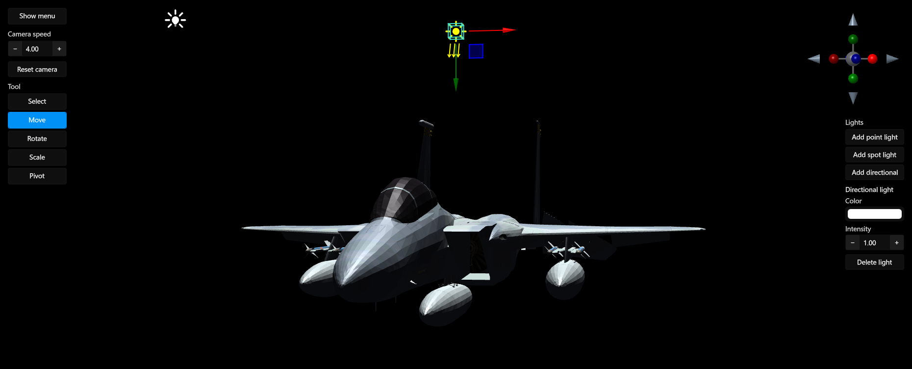
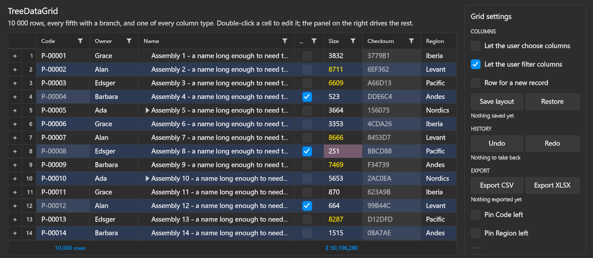
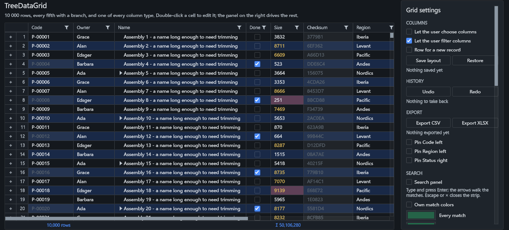
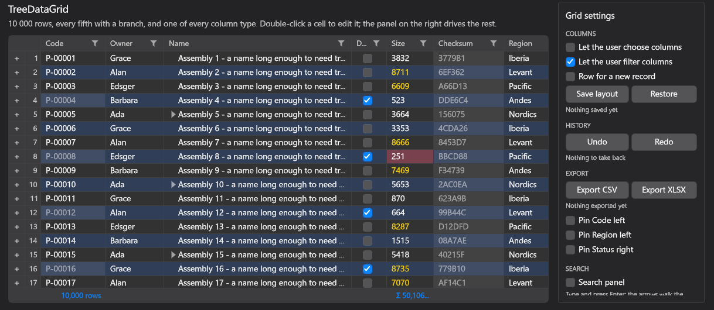

# Adamantium UI

A .NET UI framework for desktop applications, on its own Vulkan renderer: a full set of controls up to docking, a
ribbon, a tree data grid, a property grid and an infinite canvas with a node graph; markup compiled to C#; styles and
live themes; MVVM and navigation built in - and a 3D scene that is an ordinary element of the markup, drawn by the same
renderer as the interface around it.

> **Alpha.** Windows only for now; macOS and Linux are planned. The API will change between releases.



## At a glance

- **[Controls](#controls)** - from buttons and text boxes to [tabs](#tabs), [docking](#docking), a [ribbon](#ribbon),
  a [tree data grid](#data-grid), a [property grid](#property-grid) and an [infinite canvas](#infinite-canvas-and-node-graph).
- **[Shapes and vector graphics](#shapes-and-vector-graphics)** - paths, Bézier curves, B-splines and NURBS with dashed
  strokes, drawn on the GPU.
- **[Brushes, materials and effects](#brushes-materials-and-effects)** - gradients, mesh gradients, noise, fractals,
  acrylic, mica and liquid glass, shadows and auras.
- **[Animations and transitions](#animations-and-transitions)** - eased animations started from triggers, sliding
  content.
- **[Markup, styles and themes](#markup-styles-and-themes)** - AUML compiled to C#; three themes, light and dark,
  switched live.
- **[Data binding and MVVM](#data-binding-and-mvvm)** - bindings of every kind; view-models with generated properties
  and commands.
- **[Navigation](#navigation)** - regions, a navigation journal, dialogs and windows driven from view-models.
- **[Input and drag and drop](#input-focus-and-drag-and-drop)** - keyboard focus, drag and drop inside the application
  and with other applications.
- **[A 3D scene in the markup](#a-3d-scene-in-the-markup)** - an engine scene as an element of the tree, with no
  airspace and no copy of the frame.
- **[Tooling](#tooling)** - `dotnet new` templates, a Rider plugin with a live preview, a Visual Studio Code extension.

## Controls

| | |
|---|---|
| **Buttons and toggles** | `Button`, `RepeatButton`, `ToggleButton`, `CheckBox`, `RadioButton`, `ToggleSwitch` |
| **Text** | `TextBlock`, `TextBox` - see [Text](#text) |
| **Numbers and ranges** | `NumericUpDown` for integers or decimals, `Slider`, `RangeSlider` with two thumbs, `ScrollBar` |
| **Progress** | `ProgressBar`, `RingProgressBar`, `BusyIndicator` |
| **Lists and trees** | `ListBox` and a virtualized `TreeView`, each with single, multiple or extended selection; `DropDown`; `DataPager` with arrows, page numbers, a page-size picker and a page box |
| **Menus and pop-ups** | `MenuItem` with nested menus, `ContextMenu`, `ToolTip`, `Popup`, `Expander` |
| **Color** | `ColorPicker` with RGB, alpha and hex, `ColorPickerButton`, `ColorWheel` |
| **Images** | `Image`, nine-slice images |
| **Tiles** | `TilesHost` and `FlipTile`: a board of 3D tiles that tilt toward the pointer and flip on click |

### Tabs

`TabControl` for editors and browsers:

- the tab strip on any side - top, bottom, left or right - with an inner or outer selection indicator;
- pinned tabs, in a row of their own or in the same row;
- tear-off: a tab dragged out of its strip asks for a window of its own;
- an overflow menu, a scrolling strip, and a virtualized strip for a great many tabs;
- close buttons, and content that slides left, right or up on switching.

### Docking

A docking workspace in the manner of Visual Studio:

- document and tool panes in tabbed groups, split in any direction;
- a drop compass that docks a dragged pane to any side or into a group;
- panes torn off into floating windows and docked back;
- groups collapsed to the window edge and revealed on demand;
- layouts saved and restored;
- events for closing, restoring and tearing off panes; closing and tearing off can be cancelled.

### Ribbon

An Office-style ribbon:

- tabs and groups that shrink step by step and collapse as the window narrows;
- large, medium and small buttons, split buttons, drop-down buttons, toggle buttons and galleries;
- contextual tab groups;
- a quick access toolbar above or below the ribbon, and an application menu;
- key tips: press Alt and type the letters shown.

### Data grid

`TreeDataGrid` shows flat lists and trees in one control:

- sorting by several columns, shown as chips in a sort panel;
- grouping by dragging columns to a group panel;
- filters on every column and a search panel;
- totals and aggregates in a footer;
- columns frozen on the left and right, a column chooser, and a column layout that can be saved;
- cell or full-row selection;
- editing in place, a new-row line, row validation rules and undo;
- row details and row headers;
- cell states derived from values, for the theme to style ("over the limit", "settled");
- export to CSV and XLSX.

### Property grid

`PropertyGrid` is an inspector:

- names and values split by a draggable grip, in folding sections;
- several objects inspected at once: the common value is shown, differing values are marked, and an edit writes to
  every object;
- every write is reported with all its targets, ready for undo.

### Infinite canvas and node graph

`InfiniteCanvas` is a drawing board and a node editor in one:

- an unbounded plane with pan and zoom, a minimap and a view bar;
- drawing tools: pen, shapes, curves, paths, text, images and an eraser, with selection handles, transforms and
  alignment;
- a node graph: nodes with typed sockets, wires, groups and a node palette. The graph is kept evaluated while it is
  edited: only changed nodes are recomputed, in dependency order;
- an inspector and an undo history;
- SVG import and export; scenes and graphs saved and loaded.

### Windows, overlays and pop-ups

- `Window` with its own title bar, caption buttons on the right or on the left, and commands in the title bar.
- `OverlayWindow`: windows inside a window, for dialogs and tool windows.
- `SlidePanel`: a panel that slides in over the content from any edge of the window, animated, taking no layout space.
- Per-monitor DPI.

### Layout

- Panels: `Grid` with `GridSplitter`, `StackPanel`, `WrapPanel`, `DockPanel`, `UniformGrid`, `Canvas`, and virtualizing
  panels for long lists.
- `ScrollViewer`, `Viewbox`, `Border`.
- `ZoomBox`: a zoom and pan viewport - the wheel zooms toward the cursor, dragging pans, and the scale and offset are
  bindable.
- `RenderTargetPanel` for a [3D scene](#a-3d-scene-in-the-markup).

### Text

- Its own font stack: TrueType, OpenType with CFF and CFF2, font collections, WOFF and WOFF2. Glyphs are drawn from
  MSDF atlases, sharp at any scale, with OpenType kerning.
- `TextBlock`: wrapping, trimming, horizontal and vertical alignment, justification, inline runs, and outlined text.
- `TextBox`: selection, the clipboard, undo, a placeholder or a floating one, multi-line input, a length limit and a
  read-only mode.

## Shapes and vector graphics

- Shapes: `Rectangle`, `Ellipse`, `Line`, `Polyline`, `Polygon`, `RegularPolygon` and `Path`, plus quadratic and cubic
  Bézier curves, B-splines and NURBS.
- Strokes with dashes, flat, square, triangular and round caps, and bevel, miter and round joins.
- Fills and strokes are drawn on the GPU with analytic antialiasing.
- `DrawingBrush` paints with vector drawings; the infinite canvas reads and writes SVG.
- `FractalView` renders fractals.

## Brushes, materials and effects

- **Brushes:** solid; linear, radial and conic gradients; mesh gradients; noise; fractals; patterns; images; nine-slice;
  tiles; visuals; drawings.
- **Backdrop materials:** acrylic, mica and liquid glass over a real blurred backdrop.
- **Effects:** drop shadows and auras; opacity, rounded clipping and transforms on any element.

## Animations and transitions

- `DoubleAnimation` with ease-in, ease-out and ease-in-out curves, and `PulseAnimation`.
- Animations started and stopped from triggers in markup.
- Content transitions that slide left, right or up.
- Animated controls: the slide panel, flip tiles, the progress ring and the busy indicator.

## Markup, styles and themes

- **AUML** is XML in the shape of XAML, compiled to C# by a source generator at build time: no parsing at startup, and
  a typo in the markup is a build error. `x:Load` builds content only when it is needed.
- **Styles** select by type, class and property conditions, and build on each other.
- **Triggers:** property, data, multi and event triggers.
- **Templates:** control templates, data templates, hierarchical templates and template selectors.
- **Resources,** with theme resources that follow a theme switch.
- **Behaviors** attached in markup.
- **Themes:** Fluent, Editor Pro and macOS, each with light and dark variants, switched live. A control library brings
  its controls' look into every theme with one call.

The same data grid in the three themes:

| Fluent | Editor Pro | macOS |
|---|---|---|
|  |  |  |

## Data binding and MVVM

- **Bindings:** one-way and two-way, multi-bindings and converters, and bindings to an ancestor, to the element itself
  and to the template.
- **View-models:** `[ViewModel]`, `[Bindable]` and `[Command]` generate the properties and commands.
- **Views found by view-model,** with dependency injection.

## Navigation

The `Adamantium.Navigation` package:

- **Regions:** named places in the markup filled from view-models, in content controls, items controls, selectors and
  docking areas.
- **A navigation journal** with back and forward and navigation parameters. View-models are told when they are
  navigated to and from, and can refuse to leave.
- **Dialogs** from view-models, in a window or as an overlay, with results.
- **Windows and overlays** opened from view-models.

## Input, focus and drag and drop

- Keyboard focus with a focus ring and keyboard navigation; key tips in the ribbon.
- Routed events and behaviors.
- Drag and drop inside the application and with other applications through Windows drag and drop, with a drag image
  and an insertion indicator for reordering. Sources and targets are attached in markup.

## A 3D scene in the markup

For applications where a 3D view and the interface around it are one thing: CAD and engineering tools, scientific
visualization, simulators, control rooms, industrial panels, level editors.

In WPF and Avalonia the 3D renderer is the application's own, and so is the work of wiring it in: a `D3DImage` or a
child window (`HwndHost`) in WPF, GPU interop or a native host (`NativeControlHost`) in Avalonia. In Adamantium UI the
scene comes from the engine the interface is drawn with, and its panel is an element like any other:

- **The scene is an element of the tree.** `RenderTargetPanel` hosts a universe of the
  [Adamantium Engine](https://github.com/AdamantiumStudio/AdamantiumEngine)'s entity-component system. Menus, tooltips
  and popups draw over it; opacity, transforms and rounded clips apply to it.
- **No copy of the frame.** The scene renders into a surface it exports, and the panel imports it by an OS handle
  through a `SharedSurfaceDescriptor`.
- **Input follows focus.** The hosted scene gets keyboard and mouse only while its panel has focus, with mouse-look
  and cursor-capture modes for camera control.
- **One renderer for everything,** so the interface gets what a game renderer has: the materials, brushes and text
  rendering above.

| | Adamantium UI | WPF | Avalonia |
|---|---|---|---|
| A 3D scene in the window | an engine scene in a `RenderTargetPanel` | your own renderer, through `D3DImage` or `HwndHost` | your own renderer, through GPU interop or `NativeControlHost` |
| Renderer | its own, on Vulkan | Direct3D 9 | Skia |
| Docking, ribbon, tab tear-off | included | third-party suites | third-party libraries |
| Platforms | Windows; macOS and Linux planned | Windows | Windows, macOS, Linux, iOS, Android, browser |

## Tooling

- **Templates:** `dotnet new adamantium-app`, `adamantium-viewlib` and `adamantium-controllib`.
- **Rider:** the *Adamantium AUML* plugin adds a live preview beside the markup, drawn by the framework itself from the
  project's own build and in its own theme, plus completion, diagnostics and go to definition.
  <!-- TODO: link the plugin's JetBrains Marketplace page once it is published. -->
- **Visual Studio Code:** an extension with completion and diagnostics.

## Getting started

Requirements:

- **.NET 10 SDK.**
- **Windows 10 or 11, x64.**
- **A GPU and driver with Vulkan 1.4, `VK_EXT_shader_object` and `VK_EXT_descriptor_heap`** (the full list is in the
  [engine's requirements](https://github.com/AdamantiumStudio/AdamantiumEngine#requirements)). The descriptor heap is
  recent, and it sets the floor. By the reports on [vulkan.gpuinfo.org](https://vulkan.gpuinfo.org):
  - **NVIDIA:** Turing or newer - GeForce GTX 16 and RTX 20 series and later, Quadro RTX and T series, RTX A, Ada and
    Blackwell. Ampere and newer report it from driver 582, Turing from driver 595.
  - **AMD:** RDNA 3 or newer - Radeon RX 7000 and RX 9000 series, Radeon PRO W7000, and Radeon 740M, 760M, 780M and
    newer integrated graphics, with a current driver.
  - **Intel:** no Windows driver reports the descriptor heap yet.

  Developed and tested on an NVIDIA Quadro RTX 4000; other GPUs have not been tested.

```
dotnet new install Adamantium.UI.Templates
dotnet new adamantium-app -n MyApp --theme Fluent
cd MyApp
dotnet run
```

| Template | Creates |
|---|---|
| `adamantium-app` | An application: a window bound to its view-model. `--theme` picks `Fluent`, `EditorPro` or `macOS`. |
| `adamantium-viewlib` | A library of views, each with its view-model, for an application to place or navigate to. |
| `adamantium-controllib` | A library of templated controls that bring their look into every theme. |

## A window in AUML

A window with a 3D scene beside ordinary controls:

```xml
<Window xmlns="http://adamantium/ui"
        xmlns:x="http://adamantium/ui/xaml/extensions"
        xmlns:local="clr-namespace:MyApp"
        xmlns:vm="clr-namespace:MyApp.ViewModels"
        x:ViewModel="{x:Type vm:MainWindowViewModel}"
        Title="Viewer"
        Width="1280"
        Height="720">
    <Grid ColumnDefinitions="*, 280">
        <RenderTargetPanel MouseLookMode="Drag">
            <RenderTargetPanel.Behaviors>
                <local:SceneBehavior/>
            </RenderTargetPanel.Behaviors>
        </RenderTargetPanel>
        <StackPanel Grid.Column="1"
                    Margin="16">
            <TextBlock Text="Camera speed"/>
            <Slider Value="{Binding CameraSpeed, Mode=TwoWay}"
                    Minimum="0.1"
                    Maximum="10"/>
            <Button Content="Reset camera"
                    Command="{Binding ResetCameraCommand}"/>
        </StackPanel>
    </Grid>
</Window>
```

`SceneBehavior` is the application's own: it creates the engine universe that draws into the panel. The sandbox's
[`DemoUniverseBehavior`](https://github.com/AdamantiumStudio/AdamantiumUI/blob/main/Adamantium.UI.Sandbox/Behaviors/DemoUniverseBehavior.cs)
is a complete one.

The view-model is plain C# with source-generated properties and commands:

```csharp
[ViewModel]
public partial class MainWindowViewModel
{
    [Bindable]
    private double _cameraSpeed = 4;

    [Command]
    private void ResetCamera() => CameraSpeed = 4;
}
```

## Status

Alpha: what is listed above works, and the API will change. Not there yet:

- macOS and Linux - planned. The macOS code exists but has not been built and run recently;
- accessibility (UI Automation);
- localization with right-to-left layout;
- touch and pen input;
- mobile and the browser.

## Packages

| Package | What it is |
|---|---|
| `Adamantium.UI` | The one to reference: the controls, the themes, the AUML code generator and the designer host, with MVVM |
| `Adamantium.UI.Core` | The element tree, layout, input, styles, bindings, resources and the AUML runtime loader |
| `Adamantium.UI.Controls` | The controls and panels |
| `Adamantium.UI.Themes` | Fluent, Editor Pro and macOS |
| `Adamantium.UI.FX` | The UI's shaders |
| `Adamantium.UI.Markup` | The AUML parser and document model |
| `Adamantium.Navigation` | Navigation, regions and dialogs driven from view-models |
| `Adamantium.UI.Templates` | The `dotnet new` templates |

All packages share one version and are released together.

## License

[Apache-2.0](https://github.com/AdamantiumStudio/AdamantiumUI/blob/main/LICENSE). Third-party components are listed
in [THIRD-PARTY-NOTICES.md](https://github.com/AdamantiumStudio/AdamantiumUI/blob/main/THIRD-PARTY-NOTICES.md).
